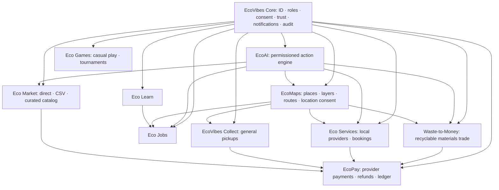

# EcoVibes master build plan

**Product:** EcoVibes Africa ecosystem
**Plan date:** 2026-10-02
**Purpose:** One shared core with independently buildable product layers. Each linked spec includes a standalone implementation prompt for this repository.

This plan is the product roadmap, not a claim that every layer is already built or ready to launch. For current repository facts, see the [system audit](../ECOVIBES_SYSTEM_AUDIT.md). For the target system boundaries, see the [architecture](../ECOVIBES_ARCHITECTURE.md).

## Product shape

EcoVibes is a family of services connected through one EcoVibes ID, a shared trust model, common data and integration contracts, and a consistent low-data experience. Product layers may have separate screens, permissions and delivery phases, but they must not invent separate accounts, conflicting user records, or their own payment truth.

## What exists today

The repo currently has a React 19 + TypeScript + Vite PWA; a Node API in `server/index.mjs`; Supabase Auth integration with an EcoVibes cookie-session bridge; versioned Supabase/Postgres migrations and local SQLite development; a Marketplace with direct listings, CSV and a Shopify connector; Quick&Handi job/offer flows; a Waste collection-request/provider-application entry point; test-mode Paystack paths; a permission-aware Chale AI search path and shared recommendations. These features still need hosted migration/deployment and production-flow verification. Check the audit for finer limits.

There is no live EcoMaps facility network, real EcoPay wallet balance, Eco Games suite, persisted Eco Learn/course system, complete Eco Jobs engine, separate general-pickup product, or complete recyclable-material settlement flow yet. Treat mock screens and sample cards as previews.

## Build order and dependencies

| Order | Layer | Why this order | Release gate |
|---|---|---|---|
| 0 | [EcoVibes Core and User Management](00-core-and-user-management.md) | Stable identity, permissions, business organizations, staff review, privacy and operational baseline. | Sign-in/recovery/revocation and staff controls are verified on the hosted database; every sensitive action is auditable. |
| 0.5 | [Eco Language and Voice](10-eco-language-and-voice.md) | Shared locale registry and Eco ID preferences make regional language support consistent; actual translations and voice providers remain gated by review and capability. | Fallback works, preferences are account-isolated, and no language/voice capability is overstated. |
| 1 | [EcoMaps](03-ecomaps.md) | Shared place/search/location contract enables services, jobs, Waste and pickup routing. Begin with locality search and a text list. | Consent, denial and manual locality work; no private coordinates leak; provider terms/coverage/cost are approved. |
| 2 | [Eco Services](05-eco-services.md) | Complete Quick&Handi’s quote/booking/completion/dispute journey for a bounded service set. | Customer/provider finish or dispute a real test booking; availability and provider verification are server-owned. |
| 3 | [Eco Market](09-eco-market.md) | Complete seller listing, stock, order, cancellation/refund and CSV flow. Keep curated product provenance separate. | Stock and order invariants pass in sandbox; signed callbacks and staff refund flow reconcile. |
| 4 | [EcoPay](02-ecopay.md) | Upgrade test payments only after one transaction journey is operational. | Approved live business, production keys in provider settings, webhook verification, refund/reconciliation and support runbook. |
| 5 | [EcoVibes Collect](08-ecovibes-collect.md) and [Waste-to-Money](07-waste-to-money.md) | Reuse trust, EcoMaps, service jobs and payment adapters while keeping distinct transaction semantics. | Pickup requests and material trades have separate statuses, records, participant permissions and end-to-end evidence. |
| 6 | [Eco Jobs + Eco Learn](06-eco-jobs-learn.md) | Skills, assessments and employer requirements can connect to real job records only after both sides are sourced and moderated. | Employers/listings verified, course completion evidence is real, application and referral outcomes are traceable. |
| 7 | [Eco Games](04-eco-games.md) | Launch small, low-data games with non-cash rewards before a developer marketplace. | Anti-cheat, age/privacy, moderation and rewards ledger are ready; no real-money wagering. |
| 8 | [EcoAI](01-ecoai.md) | The action engine depends on stable, permissioned search/action APIs in each layer. Add tools as the layer exists. | Each tool checks identity, permission, fresh domain data, confirmation requirements and audit logging. |

This is a dependency order, not a promise to build every layer before launch. A public release can include only the layers whose specific gate is met.

## Shared implementation rules

- Keep the existing repository and modular-monolith direction. Inspect current modules and migrations before editing; preserve unrelated user changes.
- Shared stack: React/TypeScript/Vite client; Node API; Supabase Auth and hosted PostgreSQL; versioned migrations; provider adapters. SQLite is for local development, not shared production truth.
- EcoVibes ID is the public account identity. Every API action rechecks ownership, organization membership, role, verification, resource status and consent server-side.
- PostgreSQL/API owns catalog, account, job, payment, score, learning and transaction facts. Browser storage may hold drafts/preferences; it must not determine money, inventory, trust or completion.
- Use append-only audit/domain events for sensitive state changes, idempotency for callbacks/retries, and an outbox for effects that must be retried.
- Keep live credentials only in hosting/provider secret settings. Never put them in chat, client bundles, example values that look real, or Git.
- Location, AI, messaging, payment, media and course/game providers sit behind explicit adapters. Record provider/source, country, currency, consent, timestamps and freshness.
- Design for low-cost Android and intermittent connectivity: useful text/list fallback, compressed/on-demand media, no required animation, retryable safe reads, and explicit handling of failed writes.
- No layer may claim a product, provider, job, course, game result, plant, live price, route, payment or user action exists unless it comes from a source that the server can verify.
- Each layer is a separate route/module and standalone prompt, but integration reuses shared contracts rather than copying account, payment or map systems.

## Cross-layer event contract

Publish stable, versioned server events only after a domain transaction succeeds. Each event has `event_id`, `event_type`, `schema_version`, `occurred_at`, `actor_user_id` or system actor, `resource_type`, `resource_id`, `country_code`, and a minimized payload. Consumers have idempotent handlers and may only read fields authorized for their purpose.

Initial event examples: `identity.role_granted`, `provider.verified`, `service.booking_completed`, `market.order_paid`, `market.refund_confirmed`, `learning.skill_verified`, `jobs.application_submitted`, `waste.batch_received`, `waste.weight_confirmed`, `collect.pickup_completed`, `game.match_completed`, `payment.settlement_confirmed`.

Do not stream private messages, identity evidence, exact locations, payment credentials, or raw cross-user behavioral data into a generic event bus or EcoAI context.

## Pan-African configuration

Model each country as configuration, not conditional code scattered across UI: ISO country code, available currency/minor units, supported payment methods, map coverage, service taxonomy/local names, languages, operational support, terms/privacy notices, age rules, and any country-specific verification or payout requirements. Ghana/GHS can be the first complete deployment. Enable another country only after local provider, language, legal, support and incident paths have been validated.

## Release gate for real customers and money

Do not announce real-money capability while Paystack is in test mode or before the merchant is approved. Before accepting payments: apply reviewed migrations to production; configure production Supabase Auth, storage, CORS, domain and server-side secrets; deploy on an always-on suitable service; verify the exact production webhook/signature and duplicate delivery behavior; complete successful and failed checkout/refund/reconciliation exercises; verify staff MFA, restore a backup, monitoring/incident handling, privacy/terms/support, and a real end-to-end transaction. Until then, label any payment path test-only and ensure it cannot imply that a user has spendable funds.

## Mini-project prompts

Each file below is meant to stand on its own in a coding agent. Pass one layer prompt at a time; start with the shared core spec. Ask the agent to inspect first, make the smallest complete vertical slice, update migrations/docs, and report hosted dependencies honestly.

- [00 · Core and User Management](00-core-and-user-management.md)
- [01 · EcoAI](01-ecoai.md)
- [02 · EcoPay](02-ecopay.md)
- [03 · EcoMaps](03-ecomaps.md)
- [04 · Eco Games](04-eco-games.md)
- [05 · Eco Services](05-eco-services.md)
- [06 · Eco Jobs + Eco Learn](06-eco-jobs-learn.md)
- [07 · Waste-to-Money](07-waste-to-money.md)
- [08 · EcoVibes Collect](08-ecovibes-collect.md)
- [09 · Eco Market](09-eco-market.md)
- [10 · Eco Language and Voice](10-eco-language-and-voice.md)
